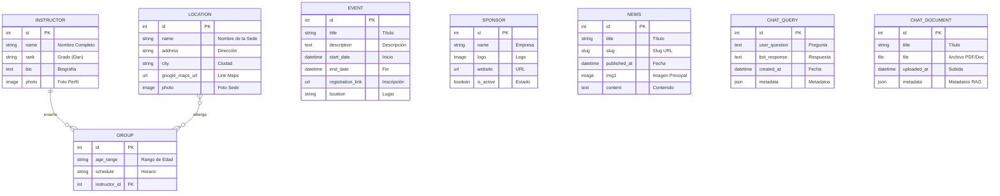

# Modelo Identidad-Relación y Estructura de la Base de Datos

Este documento describe la arquitectura de datos del sistema para el club de Taekwondo, detallando las entidades, sus atributos y las relaciones que las conectan.

## 1. Diagrama Entidad-Relación (Mermaid)

---

## 2. Explicación de las Entidades

### Núcleo de Gestión Deportiva
*   **Instructor**: Almacena la información de los maestros. Es una entidad fundamental ya que el prestigio del club se basa en su equipo técnico.
*   **Location (Sedes)**: Representa los lugares físicos donde se imparten clases. Incluye geolocalización mediante Google Maps.
*   **Group (Clases)**: Es el núcleo lógico. Define la unión entre un **Instructor**, una o varias **Sedes** y un **Horario/Edad**. 
    *   *Relación 1:N*: Un instructor puede tener múltiples grupos a su cargo.
    *   *Relación N:M*: Un grupo puede impartirse en varias sedes, y cada sede puede albergar diferentes grupos.

### Contenido Público y Marketing
*   **Event (Eventos)**: Gestión de exámenes, competiciones y seminarios. Permite enlaces externos para inscripciones.
*   **Sponsor (Patrocinadores)**: Empresas que apoyan al club. Tienen un estado de "activo" para controlar su visibilidad en el carrusel de la web.
*   **News (Noticias)**: Sistema de blog con generación automática de *slugs* para URLs amigables (SEO).

### Inteligencia Artificial (Chatbot & RAG)
*   **ChatQuery**: Registro histórico de conversaciones. Permite analizar qué preguntan más los usuarios para mejorar el servicio.
*   **ChatDocument**: Repositorio de documentos (PDFs, normativas) que alimentan el sistema RAG (Retrieval-Augmented Generation) para que el chatbot responda con base en datos oficiales del club.

---

## 3. Especificaciones Técnicas
*   **Motor**: PostgreSQL (gestionado vía Docker).
*   **Framework**: Django ORM.
*   **Almacenamiento de Medios**: Los campos `ImageField` y `FileField` guardan las referencias en la base de datos, mientras que los archivos físicos se almacenan en el directorio `/media/` del servidor.
